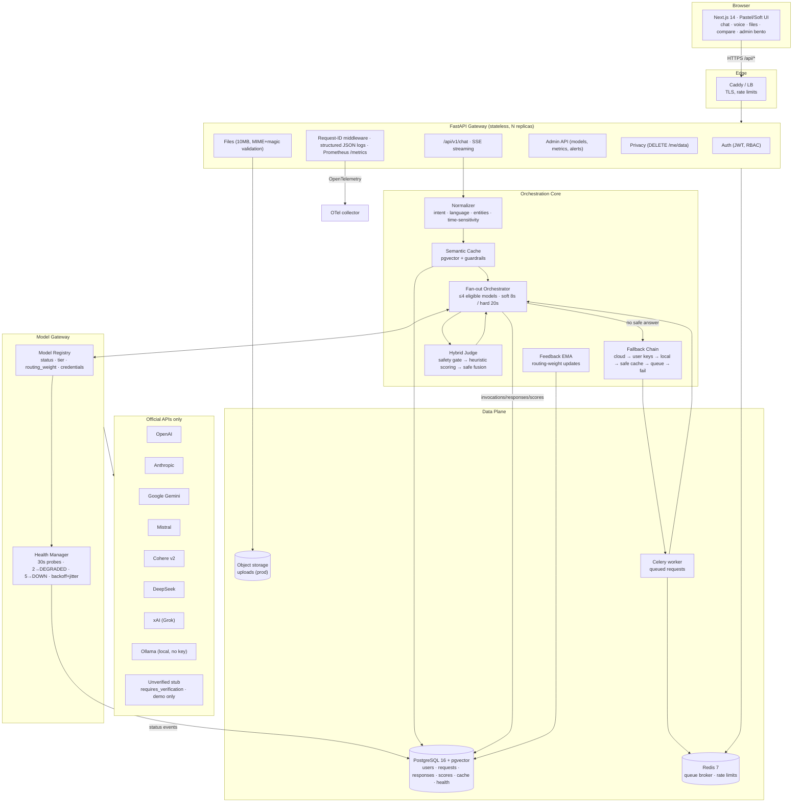

# Architecture

## 1. System diagram



## 2. Request lifecycle (one question)

1. **Normalize** — lowercase/collapse, detect language, intent (`factual | howto | compare | list | code | creative | summarise | translate | math | chat`), entities (dates, numbers, URLs, emails, quotes, proper nouns) and time-sensitivity.
2. **Semantic cache** (fast path) — embed the query; pgvector cosine top-k filtered by intent/language/user; **every guardrail must pass**: similarity ≥ 0.92, intent match, language match, entity Jaccard ≥ 0.6 with exact date/number equality, time-sensitive queries require ≤ 15 min freshness, confidence ≥ 0.85, TTL valid. One failure → regenerate.
3. **Select eligible models** — registry returns at most `MAX_FANOUT_MODELS` (4) by `routing_weight × status_multiplier`. `ACTIVE`=1.0, `DEGRADED`=0.5, `UNKNOWN` (fresh bootstrap)=0.5. `COOLING/DOWN/AUTH_REQUIRED/PAID_REQUIRED`, credential-less and unverified-stub models are excluded. Passive traffic signals (a 429 mid-request) can flip eligibility instantly.
4. **Fan out** — `asyncio.wait` with the soft deadline: if a safety-passing answer exists at 8 s, stragglers are cancelled; otherwise wait until the 20 s hard deadline. Every outcome is recorded as a typed invocation (`success | error | timeout | cancelled` with error category + rate-limit headers parsed).
5. **Judge** — hard safety gate (empty/error-leak/injection → candidate rejected), then five weighted heuristic dimensions; optional local-model tie-break; optional safe fusion of top-2 (dedupe near-identical sentences, keep citations, abort on contradiction or re-score loss, never synthesize new sentences).
6. **Anonymize & persist** — self-identification patterns are stripped, PII in answers redacted; request, invocations, responses, scores are written; gate-passing answers above cache confidence are cached.
7. **Fallback ladder** (only when needed): remaining eligible cloud models → user/admin-key models → local Ollama → safe cache with *stricter* thresholds → queue (202 + Celery) → explicit 503-style failure. Models already tried for this request are never retried (request-scoped tried-set).

## 3. Component contracts

### ProviderAdapter (abstract)
```python
class ProviderAdapter(ABC):
    name: str; requires_verification: bool; health_check_method: str  # free_endpoint|passive|tiny_prompt
    async def generate(*, model, messages, temperature, max_tokens, timeout) -> ProviderResponse
    async def stream_generate(...) -> AsyncIterator[StreamChunk]
    async def check_health() -> HealthResult
    def parse_rate_limit_headers(headers) -> RateLimitInfo      # remaining/limit/retry-after/near-exhausted
    def detect_error_type(exc) -> ErrorType
    def map_error(status_code, body, headers) -> ErrorType      # provider-specific bodies
```
Error categories: `RATE_LIMITED · QUOTA_EXHAUSTED · AUTH_EXPIRED · PAID_REQUIRED · REGION_BLOCKED · TIMEOUT · CONTENT_POLICY · PROVIDER_DOWN · UNKNOWN`.

### Health state machine
```
UNKNOWN ──1 success──────────► ACTIVE ──2 failures──► DEGRADED ──3 more──► DOWN
   │                                                                       │
   └─ auth fail ► AUTH_REQUIRED   quota/payment ► PAID_REQUIRED            │
      rate-limit ► COOLING (backoff×2 + jitter, honors retry-after)        │
                                                                           │
DOWN ──2 successes──► DEGRADED ──2 successes──► ACTIVE   (two-stage recovery)
```

### Judge weights
`relevance .35 · factuality .30 · completeness .15 · readability .10 · latency .10` — safety is a **hard gate before scoring**, fusion is conservative (see `app/judge/fusion.py`).

## 4. Failure & privacy invariants

- The final answer never contains provider error text (safety gate rejects terse error leaks), model self-identification (stripped), or raw model names (system prompt forbids + UI hides + admin reveal audited).
- Logs never contain message bodies or query strings; PII patterns are redacted.
- `DELETE /api/v1/me/data` removes every derived artifact including cache entries and on-disk uploads; the account is soft-deleted with an invalidated email.
- Uploads are untrusted: wrapped in `<user_document>` tags before reaching any model.
