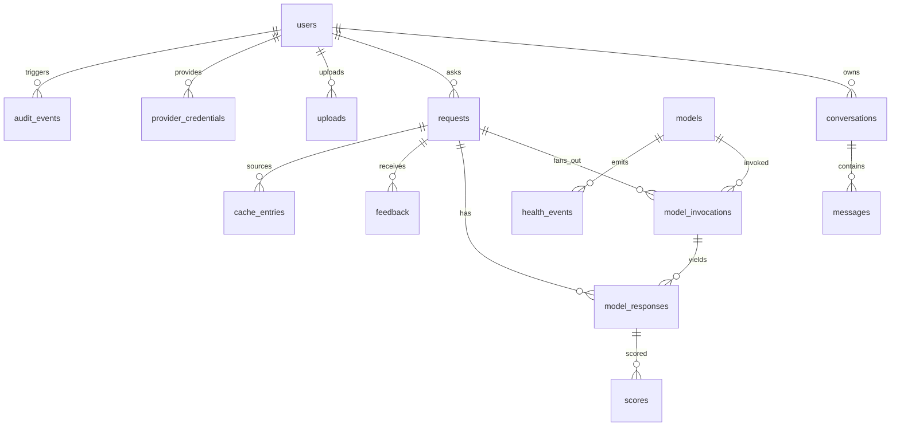

# Database schema (PostgreSQL 16 + pgvector)

Target: PostgreSQL 16 with the `vector` extension (HNSW index on cache embeddings). The same models run on SQLite for dev/tests (`EmbeddingVector` degrades to JSON, pgvector paths are skipped — used only for convenience, never production).

## Tables

### `users`
| column | type | notes |
| --- | --- | --- |
| id | uuid PK | |
| email | varchar(320) UNIQUE | overwritten on deletion (`deleted-<id>@prism.invalid`) |
| password_hash | varchar | PBKDF2-SHA256, 310k iterations (swap for argon2id in prod) |
| role | varchar(16) | `user` \| `admin` |
| display_name, preferences | text/jsonb | |
| created_at, updated_at, deleted_at | timestamptz | soft delete |

### `conversations` — `id`, `user_id FK`, `title`, `privacy_flags jsonb` (`{"incognito": true, "do_not_train": true, "ttl_hours": 24}`), timestamps, `deleted_at`.

### `messages` — `id`, `conversation_id FK`, `role` (`user|assistant|system`), `content text`, `metadata jsonb`, timestamps. Sensitive content is only stored here; it is never logged.

### `uploads` — `id`, `user_id FK`, `original_name`, `stored_path` (opaque random name), `mime_type`, `size_bytes`, `sha256`, `extracted_text`, `status` (`ready|failed`), timestamps. Files live under `PRISM_STORAGE_DIR` (object storage in prod).

### `requests` — one row per ask.
| column | notes |
| --- | --- |
| id, conversation_id, user_id | user nullable (anonymous/incognito mode) |
| normalized_query text, query_hash (sha256, indexed) | |
| intent, language, entities jsonb, time_sensitive bool | normalization output |
| cache_hit bool, final_answer text | |
| status | `completed \| queued \| failed` (cache-served = `from_cache` in API layer) |
| latency_ms, error_type, metadata jsonb | `metadata` stores fused flag, cache entry id, fallback markers |

### `models` (registry) — PK is the composite id string (`"openai/gpt-4o-mini"`).
`provider`, `endpoint`, `tier` (`primary|secondary|local|stub`), `routing_weight` (EMA-updated), `context_window`, `status` (`ACTIVE|DEGRADED|COOLING|DOWN|AUTH_REQUIRED|PAID_REQUIRED|UNKNOWN`), `capabilities jsonb`, `requires_verification bool`, `credentials_required bool`, `metadata jsonb` (seed flag, feedback_samples), `last_health_check_at`.

### `provider_credentials` — `provider`, `owner_id` (NULL = system/admin), `key_ref` (**Fernet-encrypted** key or KMS reference), `note`, `revoked_at`. Unique per (provider, owner). Raw keys never appear in logs or responses.

### `model_invocations` — per attempt: `request_id FK`, `model_id FK`, `status` (`success|error|timeout|cancelled`), `tokens_in/out`, `latency_ms`, `error_type`, `rate_limit_remaining` (parsed from provider headers). Failures and winners are all recorded.

### `model_responses` — `invocation_id FK`, `request_id FK`, `model_id`, `raw_answer text`, `score`, `selected bool`, `fused bool`, `anonymized_label` ("Candidate A"), `metadata jsonb` (fusion constituents). **Access-restricted**: the candidates endpoint serves anonymized views; admin reveal is audited.

### `scores` — per response: `relevance, factuality, completeness, readability, latency, total, passed_gate`.

### `feedback` — `request_id FK`, `user_id FK`, `rating` (+1/−1), `comment`.

### `cache_entries`
| column | notes |
| --- | --- |
| query_hash (indexed) | sha256 of normalized query |
| **embedding vector(1536)** | HNSW cosine index `ix_cache_entries_embedding_hnsw` |
| intent, language (composite index) | pre-filter for vector search |
| entities jsonb | guardrail comparison (dates/numbers must match exactly) |
| best_answer, confidence | confidence = judge score at write time |
| time_sensitivity float, ttl_seconds (86400), expires_at (indexed) | |
| user_id (nullable), is_global bool | user-scoped by default; global only for PII-free answers |
| source_request_id, last_served_at, serve_count | audit/debug |

### `health_events` — `model_id`, `status`, `error_type`, `latency_ms`, `quota_remaining`, `message`, timestamp. Append-only probe history (drives the admin health timeline).

### `audit_events` — `user_id`, `action` (e.g. `admin.reveal_candidates`, `auth.login`, `conversation.delete`), `resource_type`, `resource_id`, `detail jsonb`, `ip`.

## Indexes (beyond PKs/FKs)
- `ix_cache_entries_query_hash`, `ix_cache_entries_intent_lang`, `ix_cache_entries_expires_at`
- `ix_cache_entries_embedding_hnsw` — HNSW, `vector_cosine_ops` (m=16, ef_construction=64)
- lookups on `requests.user_id`, `messages.conversation_id`, `model_invocations.request_id`, `model_responses.request_id`, `health_events.model_id`, `audit_events.user_id`

## Deletion semantics
`DELETE /api/v1/me/data` hard-deletes (no tombstones) every derived row: scores → model_responses → model_invocations → feedback → messages → requests → conversations → uploads (+ on-disk files) → cache entries (user-scoped **and** entries whose `source_request_id` belonged to the user) → user credentials → user audit events, then soft-deletes the account (email destroyed, hash blanked). A retention job (cron/worker) should periodically hard-purge `deleted_at` users and expired cache entries.

## Migrations
Alembic (async env, URL injected from `PRISM_DATABASE_URL`). Revision `0001` bootstraps the schema from `Base.metadata` (single source of truth) and creates the vector extension + HNSW index on PostgreSQL. `alembic upgrade head` was executed and verified in this build.
